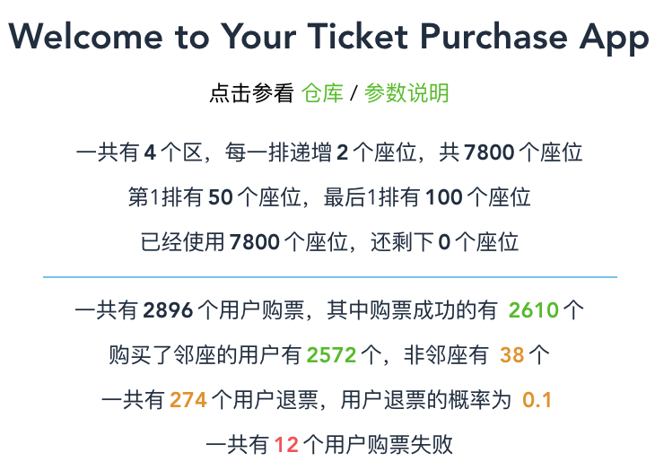

<!--
 * @Author: codytang
 * @Date: 2020-07-10 22:06:46
 * @LastEditTime: 2020-07-13 14:38:20
 * @LastEditors: codytang
 * @Description: README
-->

# Ticket Purchase 

## Demo 地址

https://cody1991.github.io/ticket-purchase/?front=50&back=100&step=2&block=4&refundRate=0.1&sleepMax=50

运行结果

---

https://cody1991.github.io/ticket-purchase

运行结果

## URL 参数使用

| 参数名          | 说明                             | 参数值          |
| --------------- | -------------------------------- | --------------- |
| displayUsersLen | 展示用户行为列表的最大值         | > 0, 默认 25    |
| sleepMax        | 模拟每次购票用户等待时间的最大值 | > 0, 默认 100ms |
| refundRate      | 用户退票的概率                   | >= 0, 默认 0.2  |
| block           | 区块数                           | > 0, 默认 2     |
| front           | 第一排的座位数量                 | > 0, 默认 2     |
| back            | 最后一排的座位数量               | > 0, 默认 20    |
| step            | 每排递增的数量                   | != 0, 默认 1    |

## 任务列表

- Other
  - [x] 新增算法的流程图
  - [x] 展示演唱会的位置使用 canvas 绘制（现在座位太多的话很卡，先简单处理，座位数太多的时候隐藏）
- Class
  - [x] User: 购票用户信息与行为
  - [x] Seats: 演唱会座位信息
  - [x] AdvancedSeas: 继承 Seats，优化购票算法
- Views
  - [x] Helloworld: 简单的项目介绍
  - [x] DisplaySeats: 展示演唱会座位
  - [x] DisplayUsers: 展示用户购票
    - [x] 展示 n 排 n 座
    - [x] 展示在第几个区域
  - [x] Intro: 演唱会现况
- Deploy (Github Pages)
  - [x] 手动构建: `sh ./deploy.sh`
  - [x] 自动构建: 接入 `Travis CI`
- Algorithm
  - [x] purchase ticket by order 按顺序购票，无太多逻辑
  - [x] 支持退票
  - [x] 随机购票
  - [x] 邻座分配（只考虑横向的邻座）

## 流程图

